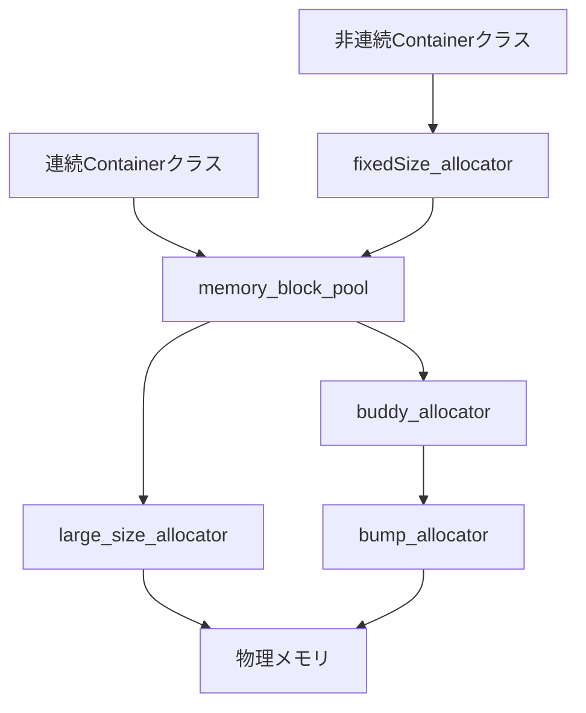
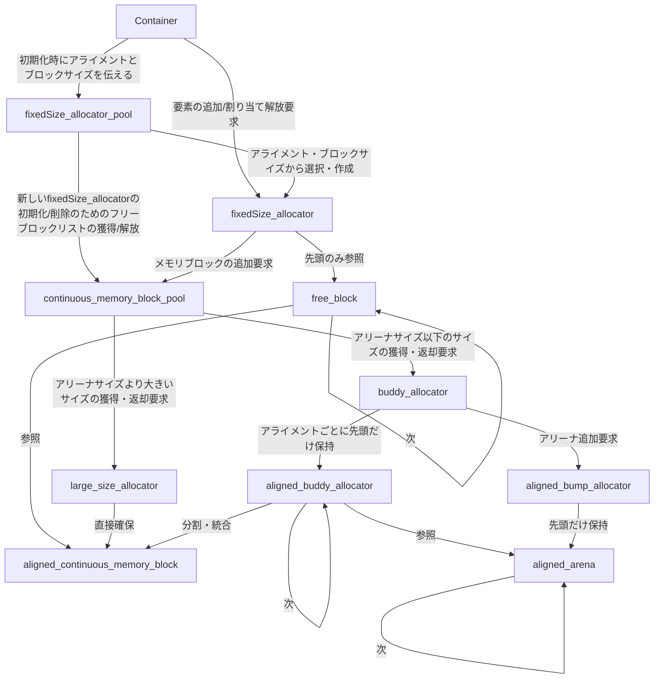

## アロケータの構成

### 用語定義

#### メモリブロック
仮想アドレス空間上で連続的なメモリ領域のこと。サイズは大きいものから小さいものまであるが2の冪乗である。

#### アリーナ
想定するメモリブロックサイズのうち最大のもの。アリーナから小さいサイズのメモリブロックを分割して割り当てを行う。
アリーナのサイズは定数化されており、例えば32MiBなどの2の冪乗サイズになります。

#### アロケータ
メモリブロックの獲得・返却要求を受け付けるオブジェクトのこと。
アロケータは空き領域や割り当て方法がアルゴリズムごとに異なり、アロケータによって名前が異なります。

#### fixedSize_allocator
固定サイズアロケータ。固定サイズのメモリブロック単位で割り当てを行うアロケータ。
内部ではメモリブロックのフリーリストを保持しており、フリーリスト内のブロックを削除・追加を行うことで割り当てと解放を行います。

#### buddy_allocator
バディアロケータ。アリーナを2の冪乗サイズのメモリブロックに分割・統合して管理するアロケータ。
内部でフリーリストを保持している。初期状態ではアリーナがフリーリストに登録されている。
要求サイズに対して、要求されたサイズを満たす最小の2の冪乗サイズの空きブロックをアリーナから探し、見つかったらそのブロックを割り当てます。
解放する際は、解放されたブロックのバディがフリーリストに存在するかを確認し、存在する場合はバディと統合してより大きなブロックを作成し、フリーリストに登録します。

#### bump_allocator
バンプアロケータ。アリーナを物理メモリから線形に確保していくアロケータ。基本的に一度確保したアリーナは解放されないため、常に新しいアリーナを確保していきます。
解放する際は全てのアリーナを一括で解放することになります。

#### large_size_allocator
ラージサイズアロケータ。アリーナサイズより大きいサイズの連続的なメモリブロックを確保するアロケータです。
要求されたサイズを満たす最小の2の冪乗サイズのメモリブロックを直接確保してaligned_continuous_memory_blockとして返します。
確保したメモリブロックを解放する際は、直接OSに返却を行います。

### メモリブロックのサプライチェーン
必要な空きメモリブロックが不足したとき、どのようにして新しいメモリブロックが供給されるかを示す図です。
矢印は依存関係を表し、上位のアロケータが下位のアロケータに対してメモリブロックの獲得・返却要求を行うことを示しています。



### クラス図
アロケータのクラス構成を示す図です。



#### 動作の流れ
コンテナクラスは新規作成時に要素の型と長さに応じたアライメントとブロックサイズとブロック数を固定サイズアロケータプールに伝えます。
固定サイズアロケータプールは、アライメントとブロックサイズに対応する固定サイズアロケータを作成済みのなかから選択してコンテナクラスに返します。
アライメントとブロックサイズの組み合わせに対応する固定サイズアロケータがプール内に存在しない場合は、
固定サイズアロケータプールはメモリブロックプールから対応するメモリブロックを指定された数だけ獲得してきて、それらをフリーリストとして固定サイズアロケータを初期化しコンテナクラスに返します。
コンテナクラスは以降の要素の追加時における割り当てやデストラクト時における解放要求は、このときに返された固定サイズアロケータに対して行います。
固定サイズアロケータの割り当ては基本的には１個ずつフリーリストからブロックを削除して行います。解放は、解放されたブロックをフリーリストの先頭に追加することで行います。
フリーリストが枯渇したときは、固定サイズアロケータはメモリブロックプールからさらに対応するメモリブロックを獲得してきてフリーリストに追加することになります。
なおコンテナクラスの種類によっては、Arrayなどの場合要素の割当てが常に仮想アドレス空間上で連続的である必要がある場合があります。
こういった場合は、固定サイズアロケータを介することなく直接メモリブロックプールに、ブロックサイズを必要バイト数（要素の型のサイズ × 要素数）を2の冪乗に丸めた値で要求を行うことになる予定です。
つまりコンテナクラスの種類によるメモリ領域の連続性の要件に応じて、固定サイズアロケータを介するかどうかが決まります。
プール内の固定サイズアロケータの寿命は参照カウントで管理されます。参照カウントが0になったときにその固定サイズアロケータをデストラクトします。
固定サイズアロケータがデストラクトされるときには、フリーブロック数が合計ブロック数と同じであることを確認してから、フリーリスト内のすべてのメモリブロックをメモリブロックプールに返却します。

メモリブロックプールは、要求されたサイズの最小の2の冪乗サイズをもつメモリブロックを獲得します。
もし対応するメモリブロックのサイズがアリーナサイズ以下の場合はバディアロケータに獲得要求を行い、そうでない場合はラージサイズアロケータに獲得要求を行います。
バディアロケータは、要求されたサイズを満たす最小の2の冪乗サイズの空きブロックをもつアリーナを探し、見つかったらそのブロックを割り当てます。
もし見つからなければ、バディアロケータは要求アライメントに対応するバンプアロケータにアリーナ追加要求を行い、新しいアリーナを確保してもらいます。
ラージサイズアロケータは、要求されたサイズを満たす最小の2の冪乗サイズのメモリブロックを直接確保して返します。
メモリブロックプールが返すメモリブロックの情報には、アドレス、サイズ、アライメントが含まれ、ブロックをプールに返すときにはプールはこの情報を元に返却するアロケータを決定することになります。
サイズがアリーナサイズ以下のブロックはバディアロケータに返却され、そうでないブロックはラージサイズアロケータに返却されることになります。
バディアロケータに返却されるときは、指定されたアライメントとアドレスを持つアリーナに対応するアライン済みバディアロケータを特定して、そのアライン済みバディアロケータに返却要求を行います。
アライン済みバディアロケータは、返却されたブロックのバディがフリーリストに存在するかを確認し、存在する場合はバディと統合してより大きなブロックを作成し、フリーリストに登録します。
アライン済みバディアロケータは、オーダーごとのフリーリストとビットマップを保持しているため、アロケーションとデアロケーションの際にはこれらを利用して効率的に管理を行える予定です。
オーダーごとのビットマップはバディインデックスから値を取得可能な形で実装される予定で、1であればそのオーダーのフリーリストに存在,0であればそのオーダーのフリーリストに存在しないことを示すことになります。

#### fixedSize_allocatorの詳細
実装上はfree_block が別オブジェクトとして aligned_continuous_memory_block を参照するより、解放済みメモリブロックの先頭を free_block として使う形にします
つまりfixedSize_allocatorの定義は以下のようなプロパティを持つクラスになります。
```cpp
    free_block* free_list_head
    block_size
    alignment
    total_block_count
    free_block_count
```
そして返却時に ptr, block_size, alignment から aligned_continuous_memory_block を再構成する感じになります。

#### 備考
- 実際に確保されるメモリブロックのサイズは、フリーリストとしてもつ実装の都合上フリーブロック構造体のサイズよりも大きなサイズとして確保されることになります。
- 固定サイズアロケータのプールのキーとしては、アライメントと実際のメモリブロックサイズの組み合わせを使用することになります。
- アライメントは常に2の冪乗に丸めこまれた値を使用することになります。
